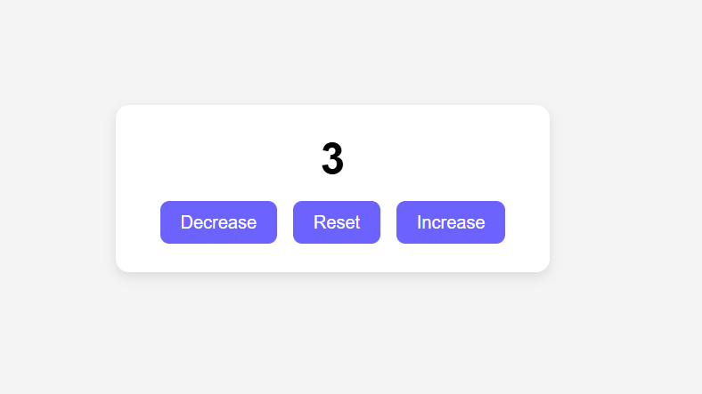

# Counter App

## About
This is a simple Counter Application built using HTML, CSS, and JavaScript. It allows users to increase, decrease, and reset the counter value with interactive buttons. This project demonstrates basic DOM manipulation and event handling in JavaScript.

## Features
- Increase counter value
- Decrease counter value
- Reset counter to zero
- Clean and user-friendly UI
- Responsive design

## Technologies Used
- HTML
- CSS
- JavaScript

## Screenshot

## How to Run
1. Clone the repository
2. Open `index.html` in your browser
3. Start using the Counter App

## Author
Sunil Ukirde
